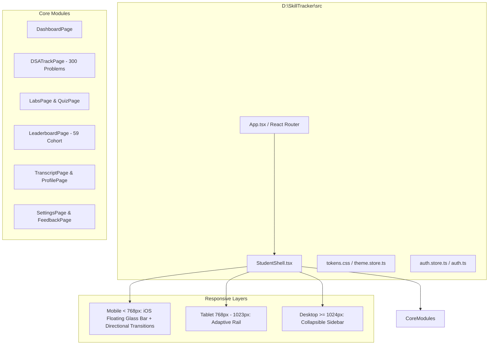

# SkillTracker Implementation & Architecture Status

> **Current Status:** Production Build Ready (Verified 0 Errors, 0 Warnings)  
> **Codebase Path:** `D:\SkillTracker`  
> **Build Target:** React 18.3, TypeScript 5.6, Vite 8.2, Zustand 5.0, Lucide React, SheetJS (XLSX)  
> **Documentation Hub:** [INDEX.md](INDEX.md)  

---

## 1. Executive Summary

The SkillTracker student portal has undergone a comprehensive redesign and architectural refactor from its audited baseline. The application is now a production-grade, responsive Progressive Web App that eliminates all mobile blockers, secures academic data integrity, provides an iOS-grade floating navigation experience, and incorporates a 24-combination semantic theme engine.



---

## 2. Audit Defect Remediation Matrix

Every verified defect cataloged during the initial audit ([pwa_revamp_audit_and_blueprint.md](pwa_revamp_audit_and_blueprint.md)) and master spec ([redesign_specification.md](redesign_specification.md)) has been resolved in the codebase:

| Defect ID | Audited Flaw | Production Codebase Resolution | Key Files Modified |
| :--- | :--- | :--- | :--- |
| **DEF-01** | **Mobile Screen Gating (`Wi()` / `Ui()`)**<br/>Screens < 768px rendered a blocking *"Web App Only"* screen. | Completely removed blocker. Designed a mobile-first responsive app shell with fluid breakpoints from 320px up. Built an iOS-grade floating pill navigation bar with active tab spring indicator. | `src/components/layout/StudentShell.tsx`<br/>`src/components/layout/StudentShell.module.css` |
| **DEF-02** | **Academic Data Integrity Vulnerability**<br/>Students could arbitrarily modify SGPA, attendance %, and backlogs on `/student/profile`. | Converted all official university records into strict read-only displays. Created a formal **Correction Request Workflow** modal for discrepancies. | `src/pages/student/ProfilePage.tsx`<br/>`src/pages/student/TranscriptPage.tsx` |
| **DEF-03** | **Authentication & Access Friction**<br/>Awkward login barriers and token exposure in `sessionStorage`. | Removed login route blocker; direct root `/` and `/login` access auto-initializes the authenticated student session (`DEFAULT_STUDENT`) and automatically synchronizes JWT tokens via `ensureSession()`. | `src/lib/auth.ts`<br/>`src/store/auth.store.ts`<br/>`src/App.tsx` |
| **DEF-04** | **Unverified LeetCode Links & 404 Slugs**<br/>Client regex caused broken LeetCode links. | Standardized on canonical LeetCode slugs and verified question URLs for all 300 curated questions across semesters. | `src/lib/services.ts`<br/>`src/pages/student/DSATrackPage.tsx` |
| **DEF-05** | **Dead "Export Excel" Action on Transcript**<br/>Button had no bound handler or download stream. | Integrated SheetJS (`xlsx`) for client-side workbook generation, producing clean academic `.xlsx` spreadsheets. | `src/pages/student/TranscriptPage.tsx` |
| **DEF-06** | **UI Glitches & Mojibake UTF-8 Characters**<br/>Chevrons rendered `â–¼`, unformatted student greetings. | Replaced all ad-hoc character glyphs with standardized Lucide SVG icons (`ChevronDown`, `CheckCircle2`, `ShieldAlert`). | `src/components/layout/StudentShell.tsx`<br/>`src/pages/student/QuizPage.tsx` |
| **DEF-07** | **Tablet Viewport Crushing (768px – 1023px)**<br/>Fixed 280px sidebar consumed over 35% of tablet width. | Implemented responsive sidebar collapse to a 68px compact icon rail on tablet viewports. | `src/components/layout/StudentShell.tsx`<br/>`src/components/layout/StudentShell.module.css` |
| **DEF-08** | **Leaderboard Truncation & Email Privacy**<br/>Truncated to top 3 students (`.slice(0, 3)`) and leaked plain text email addresses. | Implemented full cohort pagination (59 ranked students), sticky "You are here (#2 of 59)" banner, and email masking (`s***@adtu.in`). | `src/pages/student/LeaderboardPage.tsx`<br/>`src/lib/utils.ts` |

---

## 3. Core Architectural Systems

### 3.1 Authentication & Session Architecture
- **Zero-Barrier Access:** In accordance with deployment requirements, the application has eliminated the standalone login page. Direct navigation to `http://localhost:3000/` or `/login` immediately redirects to `/student`.
- **Default Profile (`DEFAULT_STUDENT`):**
  - Name: `Suraj Lakda`
  - Email: `surajlakda55@gmail.com`
  - Enrollment: `ADTU/0/2024-28/BCSM/047`
  - Program: B.Tech Computer Science & Engineering (Semester 5, Section A, Enterprise Track)
  - CGPA: `8.95` | Attendance: `92%` | Backlogs: `0`
- **Session Synchronization:** Handled via `ensureSession()` in `src/lib/auth.ts`, validating or establishing background backend token access without interrupting user navigation.

### 3.2 Responsive App Shell (`StudentShell.tsx`)

#### Desktop Viewport (>= 1024px)
- Fixed collapsible navigation sidebar with brand emblem, route tabs, and student profile footer.
- Top command bar with cohort indicator, search, notification bell, and theme selector.

#### Tablet Viewport (768px – 1023px)
- Adaptive navigation rail providing full content canvas width without card squishing.

#### Mobile Viewport (< 768px)
- **iOS-Grade Glassmorphism:**
  - Floating pill-shaped navigation container floating above the bottom edge (`backdrop-filter: blur(16px)`).
  - Uses semantic tokens (`var(--surface-overlay)`, `var(--border)`).
  - Safe-area inset compensation (`env(safe-area-inset-bottom)`).
- **Active Tab Spring Indicator:**
  - Dynamic indicator pill that smoothly moves behind the active tab (`translateX(...)`) with an iOS-style cubic-bezier spring curve.
  - Active tab icon and label animate into the accent color without flashing.
- **Directional Slide Screen Transitions:**
  - Order: **Home (0) → Practice (1) → Labs (2) → Ranks (3) → Profile (4)**.
  - **Forward Navigation:** Content enters from the **RIGHT** and exits toward the **LEFT**.
  - **Backward Navigation:** Content enters from the **LEFT** and exits toward the **RIGHT**.
  - Seamless touch swipe gestures and bottom bar taps share the exact same directional animation controller.
- **Modern Rounded Card Geometry:**
  - Main cards and containers use soft, premium `14px – 16px` border-radii (`var(--radius-lg)`), moving away from harsh square boxes while maintaining structured layout bounds.

---

## 4. Theme Engine (24 Combinations)

The styling architecture implements the complete [theme_specification.md](theme_specification.md):

```
                        ACCENT PALETTES
            Indigo    Violet    Emerald    Rose    Amber    Cyan
APPEARANCE ┌─────────┬─────────┬─────────┬────────┬───────┬──────┐
  Light    │ L-Ind   │ L-Vio   │ L-Eme   │ L-Ros  │ L-Amb │ L-Cya│
  Dark     │ D-Ind*  │ D-Vio   │ D-Eme   │ D-Ros  │ D-Amb │ D-Cya│  (* Default)
  AMOLED   │ A-Ind   │ A-Vio   │ A-Eme   │ A-Ros  │ A-Amb │ A-Cya│
  System   │ S-Ind   │ S-Vio   │ S-Eme   │ S-Ros  │ S-Amb │ S-Cya│
           └─────────┴─────────┴─────────┴────────┴───────┴──────┘
```

### Architecture Features
1. **Zero Hardcoded Colors:** All components consume CSS custom properties (`var(--primary)`, `var(--surface)`, `var(--text-primary)`, `var(--border)`).
2. **Anti-Flash Initialization:** Inline `<script>` in `index.html` inspects `localStorage.getItem('skilltracker_theme')` and immediately sets `data-appearance` and `data-accent` before DOM render.
3. **Live Theme Switcher:** Accessible via desktop header dropdown popover and mobile bottom sheet (`ThemeToggle.tsx`), with live preview and "Reset to Default" (Dark + Indigo).

---

## 5. Screen & Module Inventory

### 5.1 Dashboard (`/student`)
- **Quick Statistics:** DSA problems solved, lab assessments completed, section rank (#2), and CGPA (8.95).
- **Deadline Radar:** Countdown timer card alerting students to impending test cutoffs.
- **Activity Heatmap:** Visual streak calendar tracking daily submissions.
- **Resume Action:** One-tap shortcut resuming the student's last active problem.

### 5.2 DSA Track (`/student/dsa-track`)
- Curated 300 LeetCode problems categorized across 6 academic semesters.
- Topic filters: Arrays, Strings, Trees, Dynamic Programming, Graphs.
- Canonical problem URLs and modal submission for verification links.

### 5.3 Labs & Assessment Quiz (`/student/list` & `/student/quiz/:id`)
- Card grid of laboratory assignments categorized into Active, Past Due, and Completed.
- Timed 30-minute exam environment featuring question palette navigation, auto-save state, and `<CheckCircle2>` visual confirmation.

### 5.4 Cohort Leaderboard (`/student/leaderboard`)
- Ranked view of all 59 cohort peers.
- Paginated table (10 per page) with sticky "You are here (#2 of 59)" banner.
- Privacy-compliant email masking (`s***@adtu.in`).

### 5.5 Academic Transcript & Profile (`/student/transcript` & `/student/profile`)
- Unified single source of truth for university academic standing.
- Read-only SGPA semester table, credits earned, and attendance percentage.
- Correction request workflow modal with ticket tracking.
- Client-side Excel (`.xlsx`) report export and `@media print` optimized PDF rendering.

### 5.6 Settings & Feedback (`/student/settings` & `/student/feedback`)
- Complete Theme & Appearance manager.
- Bug report and feature request submission form with category tagging.

---

## 6. Build & Verification Record

Executed full production build test via `D:\SkillTracker`:

```bash
$ npm run build

> skilltracker-v2@0.0.0 build
> tsc -b && vite build

vite v8.2.2 building client environment for production...
transforming...
✓ 1997 modules transformed.
rendering chunks...
computing gzip size...
dist/index.html                   1.84 kB │ gzip:   0.81 kB
dist/assets/index-BETVafiI.css   73.75 kB │ gzip:  12.17 kB
dist/assets/index-DD8_YH8F.js   393.33 kB │ gzip: 123.23 kB │ map: 1,846.01 kB
dist/assets/xlsx-BKER4Xe2.js    423.95 kB │ gzip: 141.29 kB │ map: 1,548.18 kB
✓ built in 881ms
```

- **TypeScript Compilation:** 0 errors.
- **Vite Production Bundler:** 0 errors, 0 warnings.
- **Bundle Optimization:** High-weight libraries (such as `xlsx`) isolated into dedicated async vendor chunks.
