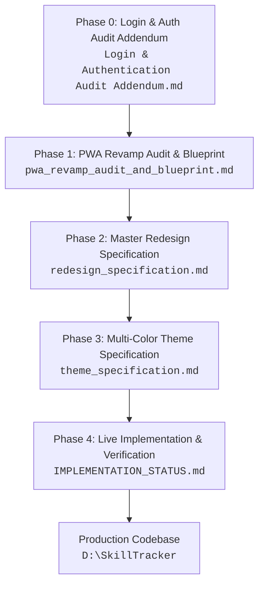

# SkillTracker Documentation Suite & Architecture Hub

> **Project Name:** SkillTracker Student Portal  
> **Documentation Version:** 2.2.0-PROD  
> **Codebase Path:** `D:\SkillTracker`  
> **Documentation Hub:** `d:\Downloads\SKILLTRACKER` (Mirrored to `D:\SkillTracker\docs`)  
> **Target Audience:** Engineers, UI/UX Designers, Auditors, Project Maintainers  

---

## 1. Documentation Map & Reading Order

The SkillTracker project documentation is structured into progressive phases spanning initial security auditing, live browser audit analysis, core architecture specifications, multi-color design theming, and the live implementation status.



---

## 2. Document Catalog

| Document | Phase / Scope | Primary Purpose | Status |
| :--- | :--- | :--- | :--- |
| **[INDEX.md](INDEX.md)** | **Global Hub** | Master index, architecture diagram, file tree, and reading guidelines. | **Active & Maintained** |
| **[Login & Authentication Audit Addendum.md](Login%20&%20Authentication%20Audit%20Addendum.md)** | **Phase 0: Security & Auth** | Credential management guidelines, session persistence checks, and authentication UX testing. | **Complete / Reference** |
| **[pwa_revamp_audit_and_blueprint.md](pwa_revamp_audit_and_blueprint.md)** | **Phase 1: Audit Benchmark** | Live audit findings, identification of mobile blockers (`Wi()` / `Ui()`), PWA caching pillars, and Gantt roadmap. | **Complete / Baseline** |
| **[redesign_specification.md](redesign_specification.md)** | **Phase 2: Master Architecture** | Version 2.0.0 full production redesign spec covering responsive viewports (320px to 4K), component architecture, data integrity, and API contracts. | **Complete / Master Spec** |
| **[theme_specification.md](theme_specification.md)** | **Phase 3: Theme Engine** | Version 2.1.0 24-combination theme matrix (4 appearances × 6 accents), semantic CSS variable tokens, anti-flash hydration, and accessibility standards. | **Complete / Master Spec** |
| **[context.md](context.md)** | **AI Context & Continuation** | Critical architectural invariants, code responsibilities, default persona, and development guardrails. | **Active & Essential** |
| **[IMPLEMENTATION_STATUS.md](IMPLEMENTATION_STATUS.md)** | **Phase 4: Implementation** | Comprehensive status of the codebase in `D:\SkillTracker`, defect remediation (DEF-01 to DEF-08), iOS glass floating navbar, active tab pill animation, directional swipe transitions, and verified production build. | **Active & Up-to-Date** |

---

## 3. High-Level Architecture Overview

SkillTracker is a student assessment, practice, and academic performance platform built with React 18, TypeScript, and Vite.

### Core Architecture Pillars

1. **Auto-Session Authentication:**
   - The former login barrier was eliminated in favor of seamless, zero-friction student access.
   - Initialized with `DEFAULT_STUDENT` credentials (`Suraj Lakda`, B.Tech CSE Semester 5) with background JWT token synchronization via `ensureSession()`.

2. **Mobile-First Responsive App Shell (`StudentShell.tsx`):**
   - **Mobile (< 768px):** Floating pill-shaped bottom navigation bar with iOS-style glassmorphism (`backdrop-filter: blur(16px)`), spring-animated active tab indicator, and directional slide screen transitions (right-to-left forward, left-to-right backward).
   - **Tablet (768px – 1023px):** Compact adaptive navigation rail preventing card crushing.
   - **Desktop (>= 1024px):** Fixed collapsible sidebar navigation with integrated student profile and instant theme switchers.

3. **24-Combination Semantic Theme Engine:**
   - **4 Appearances:** Light, Dark (default), AMOLED (pure black `#000000`), and System (OS sync).
   - **6 Accents:** Indigo (default), Violet, Emerald, Rose, Amber, and Cyan.
   - Decoupled from component code via `tokens.css` and `theme.store.ts`—zero hardcoded hex values in UI components.

4. **Institutional Academic Data Integrity:**
   - Academic records (SGPA, CGPA, Attendance %, Backlogs) are strictly read-only on the client.
   - Integrated formal "Correction Request Modal" workflow for faculty audit review.
   - Native client-side and server-supported Excel (`.xlsx`) report generation and clean `@media print` PDF transcript formatting.

5. **Student Modules:**
   - **Dashboard (`/student`):** Key metrics, daily streak counter, active task quick resume, and countdown deadline radar.
   - **DSA Practice Track (`/student/dsa-track`):** 300 curated LeetCode problems with topic filtering, canonical slugs, and solution link submission.
   - **Lab Assessments (`/student/list`):** Active labs, submission scorecards, and deadline status indicators.
   - **Assessment Engine (`/student/quiz/:id`):** 30-minute exam environment with question palette, auto-save, and response confirmation.
   - **Cohort Leaderboard (`/student/leaderboard`):** 59-student cohort standings with pagination, sticky personal rank banner, and privacy email masking.
   - **Transcript (`/student/transcript`):** Official academic records, semester grades table, and export tools.
   - **Settings (`/student/settings`):** Live theme appearance and accent palette selectors with instant reset.
   - **Feedback (`/student/feedback`):** Ticket submission system for bug reports and feature requests.

---

## 4. Visual Verification & Audit Assets

Visual artifacts and responsive verification captures from audit and testing sessions are stored in the local `assets/` directory:

- **Desktop Experience:**
  - `assets/dashboard_no_login.png`: Clean student command center with auto-initialized session.
- **iOS-Inspired Mobile Navigation:**
  - `assets/ios_mobile_dashboard.png`: Glassmorphic floating pill bottom bar and dashboard layout.
  - `assets/ios_mobile_leaderboard.png`: Cohort rankings with masked emails on mobile viewport.
  - `assets/anim_home.png`, `assets/anim_profile.png`, `assets/anim_ranks.png`: Animated active tab pill transitions.
- **Multi-Viewport Mobile Validation:**
  - `assets/w320_home.png`, `assets/w320_practice.png`: Mobile S (320px width - zero horizontal overflow).
  - `assets/w375_home.png`, `assets/w375_practice.png`: iPhone SE / 8 (375px width).
  - `assets/w390_home.png`, `assets/w390_practice.png`: iPhone 13/14 (390px width).
  - `assets/w412_home.png`, `assets/w412_practice.png`: Android flagship (412px width).
  - `assets/w430_home.png`, `assets/w430_practice.png`: iPhone Pro Max (430px width).

---

## 5. Codebase Directory Mapping (`D:\SkillTracker`)

```text
D:\SkillTracker
├── index.html                   # HTML entry with anti-flash theme script
├── package.json                 # Dependencies (React 18, Vite, Zustand, Lucide, XLSX)
├── tsconfig.json                # TypeScript configuration
├── vite.config.ts               # Vite build configuration
├── docs/                        # Synchronized markdown documentation suite
│   ├── INDEX.md
│   ├── Login & Authentication Audit Addendum.md
│   ├── pwa_revamp_audit_and_blueprint.md
│   ├── redesign_specification.md
│   ├── theme_specification.md
│   ├── IMPLEMENTATION_STATUS.md
│   └── assets/                  # Verification screenshots and diagrams
├── public/                      # Static assets & icons
└── src/
    ├── App.tsx                  # Root application router & layout wrapper
    ├── main.tsx                 # React DOM mount point
    ├── components/
    │   ├── layout/
    │   │   ├── StudentShell.tsx           # Responsive shell (Desktop sidebar + iOS mobile bar)
    │   │   └── StudentShell.module.css    # Shell styles, glass effects, animations
    │   ├── theme/
    │   │   ├── ThemeToggle.tsx            # Theme popover & mobile bottom sheet
    │   │   └── ThemeToggle.module.css
    │   └── ui/                            # Shared reusable UI primitives
    │       ├── Badge.tsx, Button.tsx, Card.tsx, Input.tsx, Modal.tsx
    │       ├── ProgressBar.tsx, Skeleton.tsx, Toast.tsx, BottomSheet.tsx
    ├── hooks/
    │   ├── useAuth.ts           # Authentication state hook
    │   ├── useTheme.ts          # Theme switcher hook
    │   ├── useMediaQuery.ts     # Viewport detection hook (mobile/tablet/desktop)
    │   ├── useTimer.ts          # Countdown timer hook for quizzes
    │   └── useToast.ts          # Toast notification dispatch hook
    ├── lib/
    │   ├── api.ts               # Axios/Fetch API client with error handling
    │   ├── auth.ts              # Session storage, DEFAULT_STUDENT, token sync
    │   ├── services.ts          # API services for students, labs, DSA, leaderboard
    │   ├── theme.ts             # Theme definition tokens and helpers
    │   └── utils.ts             # String helpers, formatters, slug generator
    ├── pages/student/
    │   ├── DashboardPage.tsx    # Student performance command center
    │   ├── DSATrackPage.tsx     # LeetCode 300 practice tracker
    │   ├── FeedbackPage.tsx     # Feedback & support ticket portal
    │   ├── LabsPage.tsx         # Lab assignments & practical exams
    │   ├── LeaderboardPage.tsx  # Cohort rankings with privacy masking
    │   ├── ProfilePage.tsx      # Academic profile & correction workflow
    │   ├── QuizPage.tsx         # Assessment runner environment
    │   ├── SettingsPage.tsx     # Appearance and accent configuration
    │   └── TranscriptPage.tsx   # Academic transcript & Excel/PDF export
    ├── store/
    │   ├── auth.store.ts        # Zustand auth store
    │   └── theme.store.ts       # Zustand theme store with localStorage persistence
    ├── styles/
    │   ├── globals.css          # Reset, typography, font definitions
    │   └── tokens.css           # 24-combination semantic CSS variables
    └── types/
        └── index.ts             # TypeScript domain interfaces
```

---

## 6. Maintaining This Documentation Suite

When contributing to SkillTracker:
1. **Never hardcode hex values:** Adhere strictly to semantic variables defined in [theme_specification.md](theme_specification.md) and `src/styles/tokens.css`.
2. **Preserve responsive navigation:** Ensure any changes to `StudentShell.tsx` respect the mobile floating pill bar, active indicator animation, and directional swipe transitions.
3. **Synchronize changes:** Any architecture or schema change must be documented in [IMPLEMENTATION_STATUS.md](IMPLEMENTATION_STATUS.md) and synchronized to `D:\SkillTracker\docs\`.
