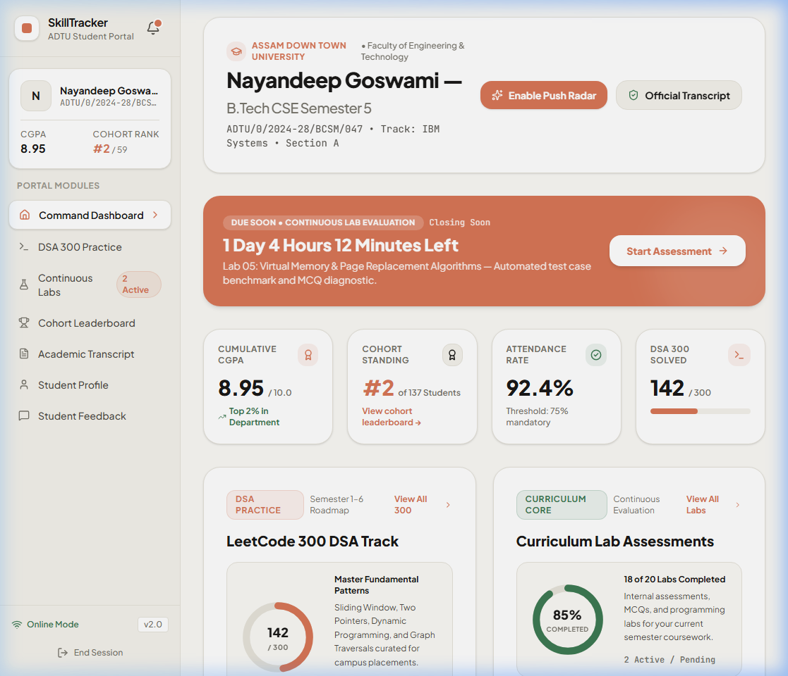
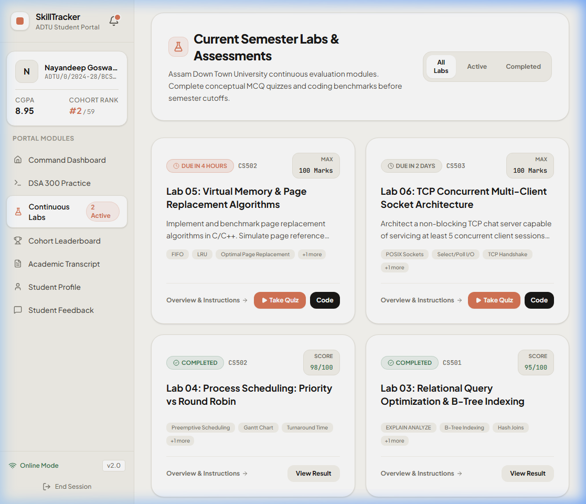
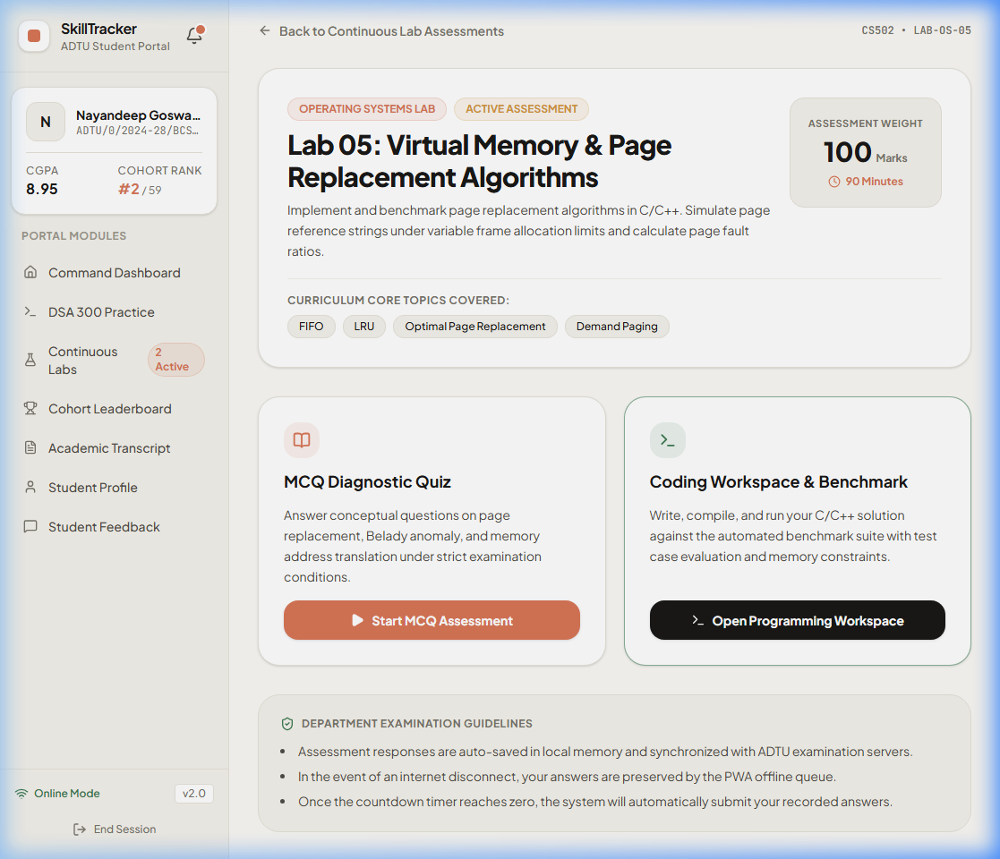
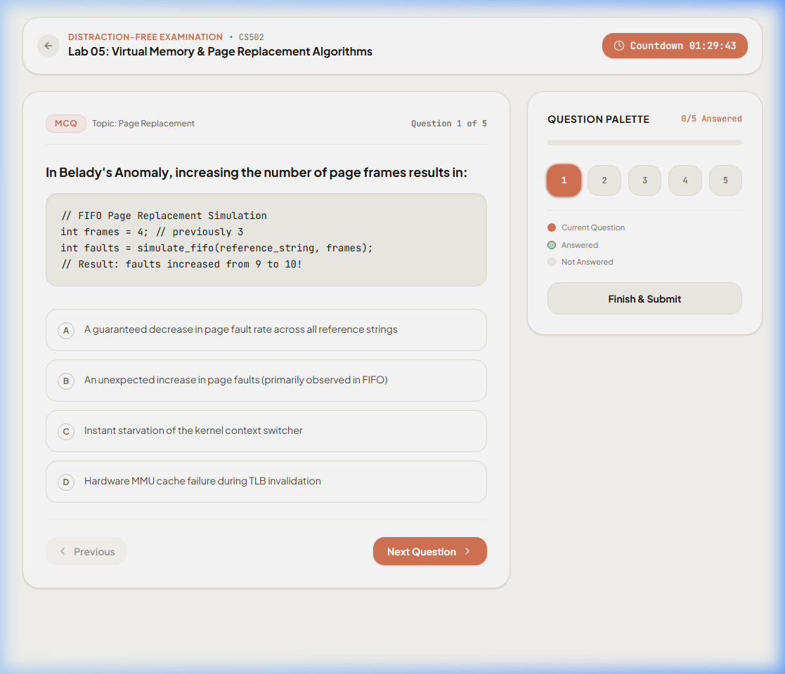
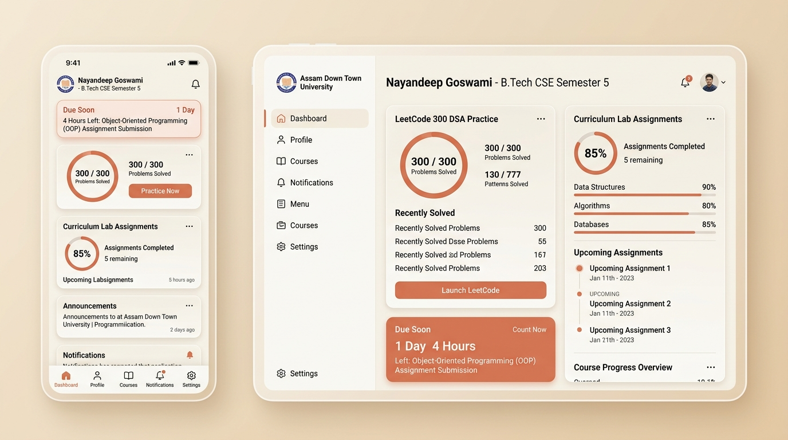
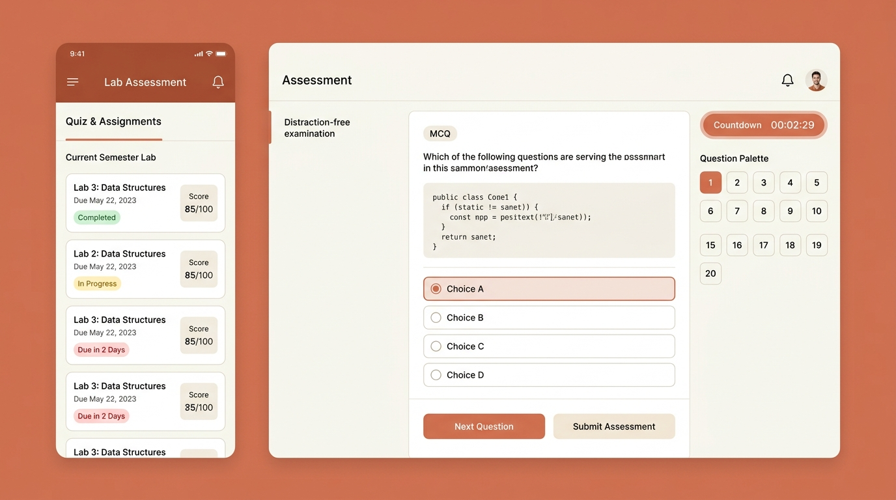
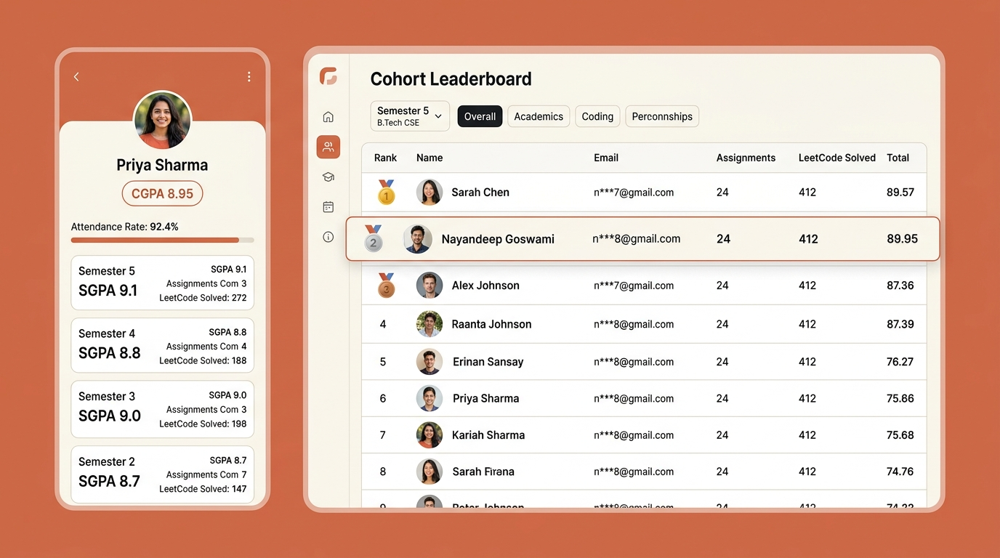

# SkillTracker UI Screenshots & Design Gallery

This document showcases the visual interface and user experience of the **SkillTracker Student Portal** for Assam Down Town University (ADTU).

---

## 1. Live Application Screenshots

### Student Command Dashboard (`/student`)

- **Top Header**: Official greeting for **Nayandeep Goswami (B.Tech CSE Semester 5)**.
- **Urgent Deadline Banner**: Live countdown timer (`1 Day 4 Hours Left`) with one-tap action to start the assessment.
- **Dual Progress Gauges**:
  - **LeetCode 300 DSA Track**: Circular progress indicator with solved challenge counter (142/300).
  - **Curriculum Lab Assessments**: 85% completion gauge with subject mastery progress bars.
- **Stat Cards**: Cumulative CGPA (8.95), Cohort Standing (#2 of 137), Attendance (92.4%), DSA Problems Solved (142).

---

### Continuous Labs List (`/student/list`)

- **Status Badges**: `Completed`, `Under Evaluation`, `Due in 4 Hours`, `Due in 2 Days`.
- **Score Indicators**: Evaluated scores (`98/100`, `95/100`) and max assessment points.
- **Action Triggers**: Quick entry points to overview, MCQ quiz, and coding workspace.

---

### Lab Overview & Instructions (`/student/detail/lab-os-05`)

- **Syllabus & Weight**: Topics covered, assessment duration (90 minutes), and total marks (100).
- **Dual Tracks**: Separate buttons for conceptual MCQ assessment and algorithm programming workspace.
- **Guidelines**: Department examination rules, auto-save warnings, and offline sync policies.

---

### Distraction-Free MCQ Quiz Workspace (`/student/quiz/lab-os-05`)

- **Focus Mode**: Automatically hides all global headers and navigation bars.
- **Timer Pill**: Prominent live countdown timer in header.
- **Question Layout**: Formatted code snippets with clean radio selection cards.
- **Question Palette**: Right-hand interactive question grid (1..5) with answered/unanswered status.

---

## 2. Design System Mockups

### Mockup 1: Dashboard & Progress Rings

### Mockup 2: Labs List & Quiz Workspace

### Mockup 3: Cohort Leaderboard & Academic Profile

