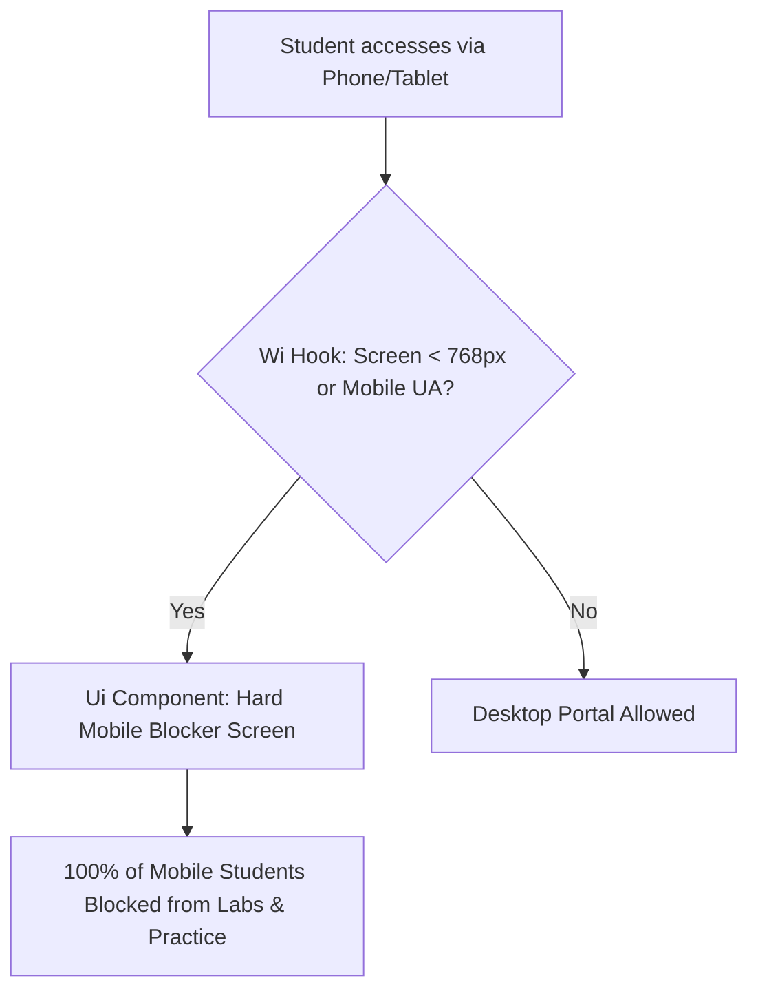
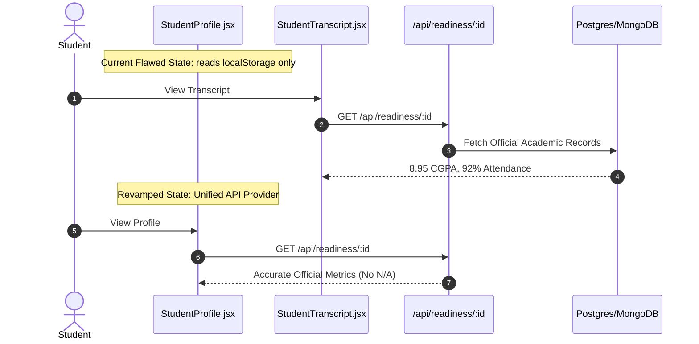
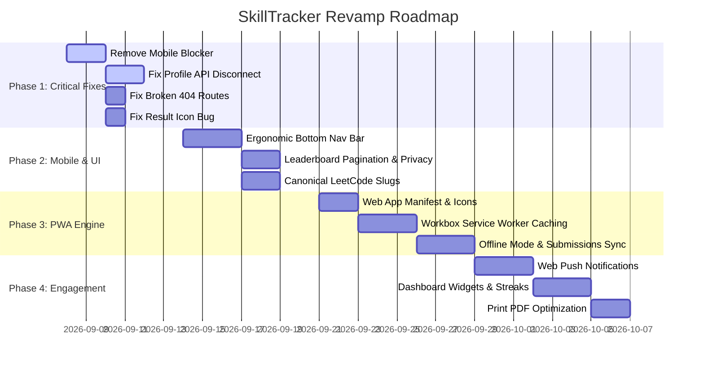

# SkillTracker Student Portal: Comprehensive Audit & PWA Revamp Blueprint

> **Audited User:** Nayandeep Goswami (`nayandg8@gmail.com`)  
> **Cohort:** B.Tech, Semester 5, Section A | Enrollment: `ADTU/0/2024-28/BCSM/047`  
> **Platform URL:** `https://theskilltracker.in/student`  
> **Stack Detected:** React 18, Vite, React Router, Tailwind CSS, REST API Backend

> **Audit Verification:** Visual audit sessions and responsive snapshots are archived in [assets/](assets/) and documented in [IMPLEMENTATION_STATUS.md](IMPLEMENTATION_STATUS.md).

---

## 1. Executive Summary

A live audit of the SkillTracker portal revealed a clean aesthetic for desktop users, but **several critical architectural flaws, data synchronization disconnects, and a hard mobile screen blocker** that prevents mobile usage entirely.



### Key Highlights:
1. **Active Mobile Blocker:** The client bundle contains an explicit gatekeeper (`function Wi()`) that blocks all screens under 768px and mobile User-Agents, greeting them with a *"Web App Only — A native mobile app is being built"* placeholder.
2. **Profile Data Disconnect:** `/student/transcript` fetches official records via `/api/readiness/:id` (8.95 CGPA, 92% attendance), whereas `/student/profile` reads exclusively from `localStorage`, displaying `N/A` and blank tables.
3. **Broken Routes & 404s:** The transcript "Edit Academic Record" button points to `/student/projects` which does not exist in React Router, leading to a dead-end 404 page.
4. **Leaderboard Truncation & Privacy:** The API returns all 59 cohort students, but the UI hardcodes `.slice(0, 3)`. Students outside the top 3 cannot see their ranking, and raw student email addresses are exposed.
5. **No PWA Capabilities:** Missing `manifest.webmanifest`, service workers, offline caching, and responsive bottom navigation.

---

## 2. Screen-by-Screen Audit & Discovered Issues

| Route | Component / Feature | Severity | Observed Issue & Impact |
|---|---|---|---|
| **Global / All** | Responsive Shell | **CRITICAL** | `Wi()` detects `window.innerWidth < 768` or mobile UA and renders a full-screen blocker (`Ui()`), preventing any smartphone usage. |
| **`/student/profile`** | Academic Profile | **CRITICAL** | Zero backend calls to `/api/readiness`. Pulls from `localStorage.getItem("student_academic_record_${id}")`, resulting in `CUMULATIVE CGPA: N/A` and empty SGPA rows. Changes made here never persist to the database. |
| **`/student/transcript`** | Transcript Actions | **HIGH** | "Edit Academic Record" button routes to `/student/projects`, returning a `404 Page Not Found`. The 404 "Return Home" button incorrectly redirects to `/` instead of `/student`. |
| **`/student/result/:id`** | Diagnostic Report | **MEDIUM** | On 100% correct answers (emerald highlight), the bullet icon displays a red cross `✗` (`<span>✗</span>`), misleading students into thinking they were penalized. |
| **`/student/leaderboard`** | Cohort Leaderboard | **HIGH** | UI hardcodes `.slice(0, 3)` despite `/api/lab-assignments/cohort/leaderboard` delivering all 59 ranked cohort records. Also exposes raw personal emails in plain text. |
| **`/student/dsa-track`** | LeetCode 300 | **MEDIUM** | Problem slugs are generated with client-side regex (`title.toLowerCase().replace(...)`), causing frequent 404s on LeetCode. Solved state is cached only in `localStorage`. |
| **Navigation Sidebar** | Track Dropdown | **LOW** | Mojibake UTF-8 character encoding bug displays `Technical Tracks â–¼` instead of a down-caret icon `▼`. |
| **Header / Sidebar** | Session Controls | **LOW** | Redundant duplicate Logout triggers present simultaneously in the left sidebar and top right banner. |
| **Global Forms** | Inputs & Accessibility | **LOW** | Input elements lack proper `id` and `name` attributes, throwing accessibility and autofill warnings in the browser console. |

---

## 3. End-to-End PWA Revamp Blueprint

To turn SkillTracker into an installable, mobile-first Progressive Web App, implement the following architectural pillars:

### Pillar 1: Mobile-First App Shell & Ergonomic Navigation

```mermaid
graph LR
    subgraph Mobile Viewport < 1024px
        MHeader[Sticky Top Header: Logo + Cohort Chip + Notifications]
        MContent[Dynamic Route View with Safe-Area Padding]
        MBottom[Fixed 5-Tab Bottom Bar: Home | Practice | Labs | Ranks | Profile]
    end
    subgraph Desktop Viewport >= 1024px
        DSidebar[Collapsible Sidebar Navigation]
        DContent[Main Content Canvas]
        DHeader[Top Command Center]
    end
```

- **Eradicate the Mobile Blocker:** Delete the `Wi()` and `Ui()` barrier functions.
- **Bottom Navigation Bar (Mobile):**
  1. **Home (`/student`):** Summary dashboard, active streak, quick resume.
  2. **Practice (`/student/dsa-track`):** Curated 300 problems with topic filtering.
  3. **Labs (`/student/list`):** Active assessments, pending deadlines, scorecards.
  4. **Leaderboard (`/student/leaderboard`):** Cohort rank standings.
  5. **Profile (`/student/profile`):** Unified academic credentials and transcript.
- **Safe Area Support:**
  ```css
  padding-bottom: calc(4rem + env(safe-area-inset-bottom));
  ```

---

### Pillar 2: Progressive Web App (PWA) Engine

#### 1. Web App Manifest (`public/manifest.webmanifest`)
```json
{
  "name": "SkillTracker Student Portal",
  "short_name": "SkillTracker",
  "description": "Student assessment, lab tracking, and DSA practice portal.",
  "start_url": "/student",
  "scope": "/",
  "display": "standalone",
  "orientation": "portrait-primary",
  "background_color": "#09090b",
  "theme_color": "#09090b",
  "icons": [
    {
      "src": "/icons/icon-192.png",
      "sizes": "192x192",
      "type": "image/png"
    },
    {
      "src": "/icons/icon-512.png",
      "sizes": "512x512",
      "type": "image/png"
    },
    {
      "src": "/icons/icon-maskable-512.png",
      "sizes": "512x512",
      "type": "image/png",
      "purpose": "maskable"
    }
  ],
  "shortcuts": [
    {
      "name": "DSA Practice",
      "url": "/student/dsa-track",
      "icons": [{ "src": "/icons/dsa.png", "sizes": "96x96" }]
    },
    {
      "name": "Lab Exams",
      "url": "/student/list",
      "icons": [{ "src": "/icons/labs.png", "sizes": "96x96" }]
    }
  ]
}
```

#### 2. Service Worker Caching Architecture (Vite PWA / Workbox)

| Strategy | Resource Types | Behavior & TTL |
|---|---|---|
| **CacheFirst** | Google Fonts (`Plus Jakarta Sans`), SVGs, CSS, JS bundles | Cached indefinitely; invalidated via bundle content hashes. |
| **StaleWhileRevalidate** | `/api/dsa-catalog`, Curriculum syllabus, Question bank statements | Serves cached version immediately while fetching updates in background. |
| **NetworkFirst** | `/api/lab-assignments/cohort/leaderboard`, Active quiz sessions | Prioritizes live data; falls back to cached snapshot if offline. |
| **NetworkOnly** | `/api/auth/login`, Quiz answer submissions | Fails gracefully if offline, queues submission via Background Sync. |

#### 3. Offline Submissions & Background Sync
- Integrate `idb-keyval` (IndexedDB):
  - If a student completes an offline practice problem or prepares a submission while disconnected, queue the action payload locally.
  - When the browser fires `window.addEventListener('online')` or Service Worker `sync`, flush the queue and notify the student with an in-app toast.

---

### Pillar 3: Data Integrity & Functional Fixes



1. **Academic Record Single Source of Truth:**
   - Retire `localStorage.getItem("student_academic_record_${id}")`.
   - Wrap the student portal with a unified `StudentContext` or React Query hook (`useStudentReadiness(studentId)`).
   - Both `/student/profile` and `/student/transcript` consume identical data.
2. **Resolve Broken Links:**
   - Change the Transcript "Edit Academic Record" button to trigger an authorized "Request Data Correction" modal or redirect to `/student/profile`.
   - Update 404 fallback links to point to `/student` instead of root `/`.
3. **Leaderboard Upgrades:**
   - Remove `.slice(0, 3)` limit; implement pagination (10 per page) or virtual scrolling.
   - Add a sticky "You are here (#2 of 59)" banner.
   - Mask emails (`n***8@gmail.com` or display Enrollment Numbers ADTU/.../047).
4. **Canonical LeetCode Slugs:**
   - Store exact LeetCode slug URLs in the problem database (e.g. `longest-substring-without-repeating-characters`) instead of dynamic regex conversion.
5. **Fix Result Marker Bug:**
   - Replace the confusing `<span>✗</span>` bullet on correct answers with `<CheckCircle2 className="text-emerald-400" />`.

---

### Pillar 4: Product Polish & Engagement Drivers

1. **Command Dashboard Redesign:**
   - Replace empty space on `/student` with:
     - **Quick Stat Banner:** Total Solved (DSA + Labs), Attendance Rate, Section Rank, CGPA.
     - **Deadline Radar:** Countdown timer for pending lab exams (e.g. *"Computer Networks Lab closes in 4h 12m"*).
     - **Daily DSA Streak:** Visual commit-style heatmap or streak counter.
     - **Resume Task:** One-tap button to resume the last visited problem.
2. **Micro-Interactions & Transitions:**
   - Skeleton screen placeholders instead of abrupt white/dark flickers during API loads.
   - Haptic feedback (via `navigator.vibrate([15])` on supported Android devices) on quiz option selections and submission success.
   - Smooth slide transitions between tabs via `framer-motion`.
3. **Push Notifications:**
   - Real-time alerts when faculty post new lab modules or announcements.
   - 24-hour and 2-hour deadline reminders.
4. **Print / Export Optimization:**
   - Clean `@media print` stylesheet removing dark backgrounds, headers, and sidebars, yielding clean, university-grade PDF transcripts.

---

## 4. Implementation Phasing Matrix


