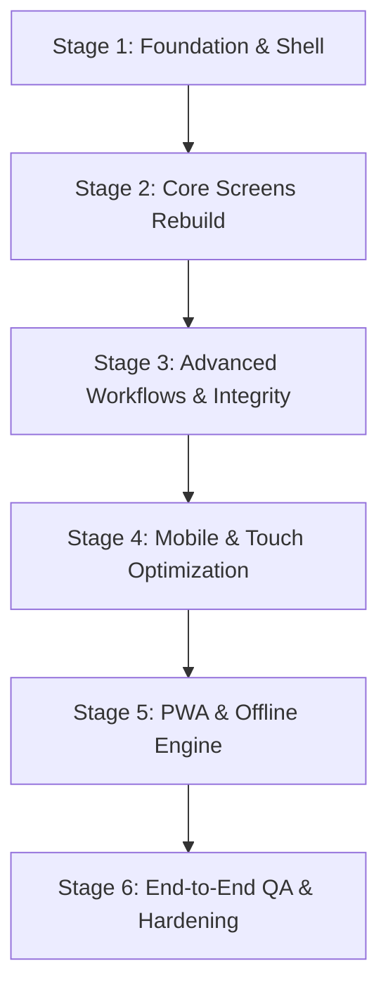

# SKILLTRACKER STUDENT PORTAL — MASTER REDESIGN SPECIFICATION
**Document Version:** 2.0.0-PROD-SPEC  
**Scope:** Complete Architecture, UI/UX, Security, Data, & Responsive Rebuild Specification  
**Target Viewports:** 320px (Mobile S) through 4K Desktop  

---

## 1. CURRENT PRODUCT BASELINE & AUDIT BENCHMARK

The existing system was audited in a live browser testing session. The audit established the exact functional inventory, API contracts, and user workflows:

* **Authenticated Role:** B.Tech Student (Semester 5 · Section A · Enterprise Track).
* **Existing Modules:**
  1. `Student Dashboard` (`/student`): High-level overview displaying LeetCode (0/300) and Lab Assignments (0/3).
  2. `Section Leaderboard` (`/student/leaderboard`): Real-time cohort standings (59 students) powered by `GET /api/lab-assignments/cohort/leaderboard`.
  3. `Technical Tracks / LeetCode 300` (`/student/dsa-track`): 300 curated questions (50 per semester), modal submission for LeetCode links.
  4. `Lab Assignments` (`/student/list`): Internal assessments, past-due and pending states, direct launch triggers.
  5. `Assessment Engine / Quiz` (`/student/quiz/:id`): Auto-saving 30-minute exam runner, question palette, MCQ selection.
  6. `Readiness Report / Transcript` (`/student/transcript`): Academic overview, attendance %, backlogs, PDF print, and broken Excel export.
  7. `Student Profile` (`/student/profile`): Basic identity attributes and self-editable semester grades.
  8. `Support & Feedback` (`/student/feedback`): Ticket submission system for bugs and feature requests.

---

## 2. VERIFIED AUDIT DEFECTS & ARCHITECTURAL REMEDIATIONS

| ID | Verified Defect from Audit | Root Cause in Current Build | Rebuild Architectural Remediation |
| :--- | :--- | :--- | :--- |
| **DEF-01** | **Mobile Gating Blocker** | Screen size `< 768px` triggers a full-page "Web App Only" blocking modal. | **100% Mobile First:** Remove blocker completely. Implement an adaptive App Shell with fixed Bottom Navigation on `< 768px` and full responsive fluid layouts from `320px` upwards. |
| **DEF-02** | **Academic Data Integrity Breach** | `/student/profile` allows students to directly edit SGPA, Attendance %, Backlogs, and Remarks. | **Read-Only Core Records:** Convert official academic fields to strict read-only. Implement a formal **"Correction Request Workflow"** requiring faculty/admin audit approval. |
| **DEF-03** | **Auth Token Storage & Form Standards** | JWT stored in client `sessionStorage` (`labToken`); login inputs lack `autocomplete` attributes. | **Secure Session Handling:** Standardize on `HttpOnly`, `SameSite=Lax`, `Secure` cookies with refresh rotation (or memory-managed access tokens); implement `autocomplete="username"` and `autocomplete="current-password"`. |
| **DEF-04** | **Unverified LeetCode Submissions** | Modal accepts arbitrary string URLs; hints warn that problem links may 404. | **Canonical Registry + Verification:** Maintain canonical LeetCode slugs/IDs. Require student LeetCode username registration and verify submission metadata via backend verification worker. |
| **DEF-05** | **Dead "Export Excel" Feature** | `<button>Export Excel</button>` on transcript has no bound handler or download stream. | **Client & Server XLSX Engine:** Implement a client-side streaming workbook generator (SheetJS/xlsx) paired with a server export endpoint that outputs valid `.xlsx` documents. |
| **DEF-06** | **UI Glitches & Character Encoding Bugs** | Dropdown chevron displays corrupted UTF-8 entities (`â-` / `%-`); greeting reads `"Welcomesurajlakda55@..."`; SGPA placeholder has `e.g. 8.5€`. | **Design System Standardization:** Standardize on Lucide SVG icons; enforce proper string interpolation templates; sanitize all placeholder and formatting strings. |
| **DEF-07** | **Tablet Compression** | Fixed 280px sidebar on 768px viewports leaves <500px for content, crushing cards. | **Adaptive Tablet Rail/Drawer:** On `768px–1024px`, collapse sidebar to a 68px compact icon rail or an off-canvas slide-over drawer. |
| **DEF-08** | **Privacy Exposure on Leaderboard** | Cohort tables display full unmasked student email addresses. | **Privacy Masking:** Display student full name with university roll number/avatar; mask emails (e.g. `s***@adtu.in`) unless viewing own profile. |

---

## 3. PRODUCT VISION & CORE PRINCIPLES

SkillTracker 2.0 is **a modern student performance, practice, and assessment command center**. It merges the rigor of institutional academic record-keeping with the responsiveness, clean typography, and motivating gamification of modern engineering tools.

### Core Principles
1. **Zero Gatekeeping:** Mobile is a first-class citizen. A student walking to class must be able to check their section rank, review upcoming lab deadlines, or read feedback on their phone.
2. **Institutional Grade Integrity:** Academic metrics (SGPA, Attendance, Backlogs) are official university records. Students view them with crystal clarity, but cannot tamper with them.
3. **Information Density without Clutter:** Use clean tabular grids, proportional statistics cards, and clear typography instead of decorative cards with empty margins.
4. **Token-Driven Aesthetics:** Four switchable, persistent themes (Dark, Light, AMOLED, Signature) driven by strict CSS custom properties without hardcoded component hex colors.
5. **Deterministic Security:** All critical business rules (exam submission validity, correction requests, exam timers, answer validation) are strictly evaluated on the server.

---

## 4. RESPONSIVE APP SHELL ARCHITECTURE

The application shell adapts fluidly across three distinct viewport tiers:

```
+-------------------------------------------------------------------------------+
| DESKTOP (>= 1024px)                                                           |
| +------------+--------------------------------------------------------------+ |
| | Sidebar    | Header: Global Search | Notifications | Theme | User Menu    | |
| | (240px)    +--------------------------------------------------------------+ |
| |            | Page Content Area (Max width: 1400px, responsive grid)       | |
| |            |                                                              | |
| +------------+--------------------------------------------------------------+ |
+-------------------------------------------------------------------------------+

+-------------------------------------------------------------------------------+
| TABLET (768px - 1023px)                                                       |
| +------+--------------------------------------------------------------------+ |
| | Rail | Header: Breadcrumbs | Notifications | Theme | User Avatar          | |
| | (68px+--------------------------------------------------------------------+ |
| | icon)| Page Content Area (2-column adaptive layout)                       | |
| +------+--------------------------------------------------------------------+ |
+-------------------------------------------------------------------------------+

+-------------------------------------------------------------------------------+
| MOBILE (320px - 767px)                                                        |
| +---------------------------------------------------------------------------+ |
| | Top Header (48px): Brand Icon | Campus/Term Badge | Notifications | Avatar| |
| +---------------------------------------------------------------------------+ |
| | Scrollable Body Container (Single-column card flow, pb-20 for safe nav)   | |
| |                                                                           | |
| +---------------------------------------------------------------------------+ |
| | Bottom Nav (56px + env(safe-area-inset-bottom)):                          | |
| | [ Home ]    [ Practice ]    [ Labs ]    [ Leaderboard ]    [ Profile ]    | |
| +---------------------------------------------------------------------------+ |
+-------------------------------------------------------------------------------+
```

### 4.1 Desktop (>= 1024px)
* **Sidebar:** Fixed width `240px` (collapsible to `68px` mini-mode).
  * Brand header with logo SVG and current build tag.
  * Primary navigation list with active pill indicator.
  * Nested submenu for "Practice Tracks" (LeetCode 300, Lab Exams, Core DSA) with SVG animated chevrons.
  * User badge at bottom with avatar, masked name, track badge, and quick logout.
* **Top Header:** Height `56px`. Sticky `backdrop-blur`.
  * Contextual breadcrumbs (`Dashboard > Semester 5 > Lab Assessments`).
  * Quick-search palette trigger (`Ctrl + K`).
  * Semester/Section indicator badge (`B.Tech · Sem 5-A`).
  * Theme switcher button (Cycle Dark -> Light -> AMOLED -> Signature).
  * Notification center bell with unread badge.
* **Content Canvas:** Margin-left `240px`, padding `24px 32px`, max-width `1440px` centered.

### 4.2 Tablet (768px - 1023px)
* **Adaptive Rail:** Sidebar collapses into a `68px` icon rail with tooltip hovers.
* Alternatively, a swipeable left drawer triggered by a header hamburger button.
* Main content grid switches from 3 columns to 2 columns with reduced gutters (`16px`).

### 4.3 Mobile (320px - 767px)
* **Top Mobile Header:** Height `48px`, fixed at top. Shows logo, current term pill, notification trigger, and profile avatar.
* **Bottom Navigation Bar:**
  * Height: `56px + env(safe-area-inset-bottom)`.
  * Fixed bottom docking with `backdrop-blur` and top border.
  * 5 Primary destinations:
    1. **Home** (`/student`) — Dashboard, quick stats, active reminders.
    2. **Practice** (`/student/dsa-track`) — LeetCode 300 tracker and problems.
    3. **Labs** (`/student/list`) — Lab assignments, assessments, and quizzes.
    4. **Ranks** (`/student/leaderboard`) — Section and cohort leaderboard.
    5. **Profile** (`/student/profile`) — Profile, academic record, transcript link, settings.
  * Touch target size: `48px x 48px` minimum per tab item.
  * Active state: Filled SVG icon + primary color glow + micro text label.

---

## 5. DASHBOARD REDESIGN (THE STUDENT COMMAND CENTER)

The new dashboard replaces the low-density 2-card layout with a high-utility, structured command center.

### 5.1 Above-The-Fold Information Architecture

```
+-----------------------------------------------------------------------------------------------+
| GREETING & CONTEXT BANNER                                                                     |
| "Welcome back, [Student Name] · B.Tech Computer Science & Engineering (Semester 5 · Section A)|
+------------------------------------+------------------------------------+---------------------+
| ACADEMIC STANDING (Read-Only)      | PRACTICE & CURRICULUM              | COHORT BENCHMARK    |
| CGPA: 8.74 / 10.00                 | LeetCode 300: 42 / 300 (14%)       | Section Rank: #25/59|
| Attendance: 88.5% (Safe > 75%)     | Labs Completed: 2 / 3 (1 Pending)  | Top Quartile        |
| Backlogs: 0 Active                 | Consistency: 6-Day Streak 🔥       | Delta: +3 this week |
+------------------------------------+------------------------------------+---------------------+
```

### 5.2 Card Hierarchy
1. **Urgent Action / Next Task Widget:**
   * Direct prompt for pending labs (e.g. `Network Topologies Assessment — Due in 3 days`).
   * Primary action button: `Start Lab →` or `Resume Practice →`.
2. **Academic Health Quadrant (Official Records):**
   * CGPA gauge with historical semester trend sparkline.
   * Attendance meter with color-coded safety margins (Green >=80%, Yellow 75-79%, Red <75%).
   * Active Backlogs tracker (`0 Active — Placement Eligible`).
3. **Practice Track Progress (LeetCode 300):**
   * Donut chart: Easy / Medium / Hard distribution.
   * Semester-specific target progress (`Semester 5: 18 / 50 Assigned Solved`).
   * Quick link to `Continue Solving`.
4. **Recent Activity & Submission Feed:**
   * Chronological log of recent quiz attempts, accepted LeetCode solutions, and announcements.

### 5.3 Device Layout Matrix
* **Desktop:** 3-column top statistics row, 2-column main body (Left: Pending Labs & DSA Track; Right: Leaderboard snippet & Activity).
* **Tablet:** 2-column grid.
* **Mobile:** Vertical stack in order: Urgent Action Banner -> Academic Stats Row (horizontal swipeable scroll) -> LeetCode Card -> Labs Card -> Cohort Standing snippet.

---

## 6. TECHNICAL TRACKS & LEETCODE 300 REDESIGN

### 6.1 Problem Suite Structure & Filtering
* Full suite of 300 curated problems organized into 6 semesters (50 problems/semester).
* **Filters:**
  * Semester Selector (`Sem 1` through `Sem 6`, defaults to student's enrolled term).
  * DSA Category Chips (`Arrays`, `Strings`, `Two Pointers`, `Trees`, `Dynamic Programming`, `Backtracking`).
  * Difficulty Pill Filters (`All`, `Easy`, `Medium`, `Hard`).
  * Status Filter (`All`, `Solved`, `Unsolved`, `Under Review`).
  * Search Bar: Real-time search across LeetCode ID (`LC-17`), problem title, and topic tags.

### 6.2 Problem Row Item Specification
Each problem card/row displays:
* **LeetCode ID & Tag:** (e.g., `LC-17` · `Medium`).
* **Canonical Title:** (e.g., `Letter Combinations of a Phone Number`).
* **Topic Badge:** (e.g., `Backtracking`).
* **Status Pill:**
  * `Unsolved` (Slate outline).
  * `Solved` (Emerald filled with checkmark).
  * `Submitted / Verifying` (Amber pulse).
* **Action Button:**
  * If Unsolved: `Solve Challenge →` (Opens modal).
  * If Solved: `View Submission ↗` (Opens verified submission receipt).

### 6.3 Verification Architecture
```
[Student clicks 'Solve Challenge']
             │
             ▼
[Modal displays verified canonical problem URL: https://leetcode.com/problems/letter-combinations-of-a-phone-number/]
             │
             ▼
[Student solves on LeetCode]
             │
             ▼
[Student submits LeetCode Submission ID / URL]
             │
             ▼
[SkillTracker Verification Engine]
   ├─ Checks format matches canonical pattern (https://leetcode.com/problems/<slug>/submissions/<id>/)
   ├─ Verifies problem slug corresponds to canonical target question
   ├─ Validates against registered student LeetCode username (prevents link recycling across students)
   └─ Marks problem as Solved upon verification, increments student counter, updates section leaderboard
```

---

## 7. LAB ASSIGNMENTS & ASSESSMENT ENGINE REDESIGN

### 7.1 Assignment Workspace View (`/student/list`)
* **Tabs:**
  * `All Assignments (N)`
  * `Active / Pending (N)`
  * `Completed / Evaluated (N)`
  * `Past Due (N)`
* **Assignment Card Data Points:**
  * Title and Subject Code (`24BCSM 3107R · Backend Programming and API Design`).
  * Faculty Instructor Name (`Mr. Steven Mankina`).
  * Question Count & Total Marks (`2 Questions · 10 Marks`).
  * Due Date with countdown badge (`Due in 48 hours` or `Past Due`).
  * Status Badge (`Pending`, `In Progress`, `Submitted`, `Graded: 10/10`).
  * Contextual Action: `Start Lab →`, `Resume →`, `View Results →`.

### 7.2 Assessment / Quiz Engine Interface (`/student/quiz/:id`)
* **Exam Header:**
  * Assessment title and course code.
  * Real-time countdown timer (`MM:SS`) synced with server expiration.
  * Live connectivity status pill (`● Connected · Autosaved 2s ago`).
  * `Quit / Exit` button with warning confirmation dialog.
* **Main Exam Canvas:**
  * Question numbering header with allocated marks (e.g., `Question 1 of 2 · 5 Marks`).
  * Rich-text question description with syntax-highlighted code snippets where applicable.
  * Accessible Radio Group for MCQ options (large touch targets >= 48px, keyboard navigable with arrow keys).
  * For coding questions: Integrated Monaco/CodeMirror editor with language selection and test-case runner.
* **Sidebar / Drawer Question Palette:**
  * Visual grid of all questions:
    * Grey: Unvisited.
    * Blue outline: Current question.
    * Emerald: Answered & saved.
    * Amber: Marked for review.
* **Integrity & Security Controls:**
  * **Answer Safety:** Server returns questions, options, and question IDs **without** correct answers. Answers are evaluated server-side upon final submission.
  * **Autosave Engine:** State changes debounce-synced every 3 seconds to `POST /api/lab-assignments/:id/save-progress`. If page reloads, answers restore instantly.
  * **Submission Safeguard:** "Submit Assessment" requires explicit modal confirmation showing total answered vs. unanswered questions.

---

## 8. SECTION LEADERBOARD REDESIGN

### 8.1 Gamification & Ranking Engine
* **Podium View (Top 3):**
  * Gold, Silver, Bronze cards with student name, avatar initials, solved count, and lab marks.
  * Visual tier crowns without childish iconography.
* **Sticky Current-User Floating Bar:**
  * Fixed bottom or highlighted row: `Your Standing: #25 of 59 Students · 0 Solved · 0 Marks · 24 students ahead of you`.
  * Click to instantly smooth-scroll to user's exact position in the list.
* **Table & Card Dual-Presentation:**
  * **Desktop:** High-density data table (Rank, Student Name & Roll No, DSA Problems Solved, MCQ Lab Score, Composite Index, Trend).
  * **Mobile:** Responsive Ranking Cards with rank badge, student avatar, formatted name, and score badges.
* **Search & Cohort Filtering:**
  * Search by student name or roll number.
  * Department dropdown (`BTECH`), Semester dropdown (`Sem 5`), Section dropdown (`Section A, B, C, D`), Track filter (`All`, `IBM`, `TCS`, `Core`).
* **Privacy Controls:** Raw personal email addresses are hidden. Names and department roll numbers are shown.

---

## 9. PROFILE & ACADEMIC INTEGRITY SYSTEM

### 9.1 Two-Tier Profile Architecture

```
+-------------------------------------------------------------------------------+
| TIER 1: IDENTITY & ENROLLMENT (Personal Profile)                              |
| Full Name: Suraj Lakda                    Enrollment No: ADTU/0/2024-28/...   |
| Institutional Email: student@university   Department: B.Tech CSE              |
| Contact Phone / Links: GitHub, LinkedIn   Section: A  |  Track: IBM           |
| [Edit Basic Details Button]                                                   |
+-------------------------------------------------------------------------------+
| TIER 2: OFFICIAL ACADEMIC TRANSCRIPT RECORDS (Strictly Read-Only)             |
| Semester 1 | SGPA: 8.40 | Backlogs: 0 | Attendance: 92% | Remarks: Exemplary  |
| Semester 2 | SGPA: 8.65 | Backlogs: 0 | Attendance: 90% | Remarks: Exemplary  |
| Semester 3 | SGPA: 8.80 | Backlogs: 0 | Attendance: 88% | Remarks: First Class|
| Semester 4 | SGPA: 8.92 | Backlogs: 0 | Attendance: 89% | Remarks: First Class|
| Semester 5 | SGPA: --   | Backlogs: 0 | Attendance: 87% | Remarks: In Progress|
|                                                                               |
| [🔒 Records Verified by University Registrar]     [Request Data Correction →] |
+-------------------------------------------------------------------------------+
```

### 9.2 Data Correction Request Workflow
1. Student identifies an error in their official record (e.g. incorrect attendance percentage or SGPA).
2. Student clicks **"Request Data Correction"**.
3. A standardized modal opens:
   * **Semester:** Dropdown (`Semester 1` through `Semester 6`).
   * **Field to Correct:** Dropdown (`SGPA`, `Attendance %`, `Backlog Status`, `Subject Grade`).
   * **Current Value:** Read-only system value.
   * **Claimed Correct Value:** Input field with validation.
   * **Justification / Reason:** Textarea (minimum 20 characters).
   * **Proof Attachment:** File upload (PDF/JPG of official marksheet or attendance slip).
4. Submitting creates a record in `correction_requests` table with status `PENDING_REVIEW`.
5. Profile displays a badge: `1 Correction Request Pending Review`.
6. Only faculty/admin role can approve or reject the request via the admin console. Upon approval, the database updates via audit log.

---

## 10. TRANSCRIPT & EXPORT WORKFLOW

### 10.1 Academic Performance Transcript Design
* Formal header: University crest SVG, Institution name (*Assam Down Town University*), Faculty, and Program.
* Verified student metadata block (Name, Roll Number, Enrollment ID, Degree, Current Semester).
* Performance tables:
  1. Semester Academic Record (SGPA, CGPA, Credits Earned, Attendance %).
  2. Technical Tracks & Practical Coding (LeetCode DSA Mastery, Lab MCQ scores).
  3. Professional Remarks and Accreditation stamps.

### 10.2 Export Implementations
* **Print PDF (`window.print()`):**
  * Dedicated `@media print` stylesheet.
  * Hides sidebar, headers, buttons, theme toggles, and navigation elements.
  * Forces white background, sharp black typography, clean border rules, and page-break controls (`break-inside: avoid`).
* **Export Excel (`.xlsx`):**
  * Built using client-side spreadsheet engine (`SheetJS`/`xlsx`).
  * Generates a multi-tab workbook:
    * Tab 1: `Academic_Summary` (CGPA, SGPA per semester, Attendance).
    * Tab 2: `Lab_Evaluations` (Scores, dates, submissions).
    * Tab 3: `DSA_Progress` (Solved problems list and timestamps).
  * Automatically triggers native file download `Student_Transcript_[EnrollmentNumber].xlsx`.

---

## 11. DESIGN TOKEN & MULTI-THEME SYSTEM

All UI components consume standard CSS custom properties. No hardcoded hex values are permitted in application code.

### 11.1 Design Tokens Specification

```css
:root {
  /* Common Metrics */
  --radius-xs: 4px;
  --radius-sm: 8px;
  --radius-md: 12px;
  --radius-lg: 16px;
  --radius-xl: 24px;
  --radius-full: 9999px;
  
  --font-sans: 'Plus Jakarta Sans', system-ui, -apple-system, sans-serif;
  --font-mono: 'JetBrains Mono', monospace;
  --font-serif: 'Lora', serif;

  --transition-fast: 150ms cubic-bezier(0.4, 0, 0.2, 1);
  --transition-normal: 250ms cubic-bezier(0.4, 0, 0.2, 1);
}

/* 1. DARK THEME (Default) */
[data-theme="dark"] {
  --background: #0b0f17;
  --surface: #111827;
  --surface-elevated: #1a2234;
  --surface-hover: #222d42;
  --border: #1f293d;
  --border-subtle: #162032;

  --primary: #6366f1;
  --primary-hover: #4f46e5;
  --primary-subtle: rgba(99, 102, 241, 0.12);
  
  --accent: #38bdf8;
  --accent-subtle: rgba(56, 189, 248, 0.12);
  
  --success: #10b981;
  --success-subtle: rgba(16, 185, 129, 0.12);
  
  --warning: #f59e0b;
  --warning-subtle: rgba(245, 158, 11, 0.12);
  
  --danger: #ef4444;
  --danger-subtle: rgba(239, 68, 68, 0.12);

  --text-primary: #f8fafc;
  --text-secondary: #94a3b8;
  --text-muted: #64748b;
  
  --focus-ring: rgba(99, 102, 241, 0.4);
}

/* 2. LIGHT THEME */
[data-theme="light"] {
  --background: #f8fafc;
  --surface: #ffffff;
  --surface-elevated: #f1f5f9;
  --surface-hover: #e2e8f0;
  --border: #e2e8f0;
  --border-subtle: #f1f5f9;

  --primary: #4f46e5;
  --primary-hover: #4338ca;
  --primary-subtle: rgba(79, 70, 229, 0.08);

  --accent: #0284c7;
  --accent-subtle: rgba(2, 132, 199, 0.08);

  --success: #059669;
  --success-subtle: rgba(5, 150, 105, 0.08);

  --warning: #d97706;
  --warning-subtle: rgba(217, 119, 6, 0.08);

  --danger: #dc2626;
  --danger-subtle: rgba(220, 38, 38, 0.08);

  --text-primary: #0f172a;
  --text-secondary: #475569;
  --text-muted: #94a3b8;

  --focus-ring: rgba(79, 70, 229, 0.25);
}

/* 3. AMOLED TRUE-BLACK THEME */
[data-theme="amoled"] {
  --background: #000000;
  --surface: #0a0a0a;
  --surface-elevated: #141414;
  --surface-hover: #1f1f1f;
  --border: #222222;
  --border-subtle: #141414;

  --primary: #6366f1;
  --primary-hover: #818cf8;
  --primary-subtle: rgba(99, 102, 241, 0.18);

  --accent: #38bdf8;
  --accent-subtle: rgba(56, 189, 248, 0.18);

  --success: #10b981;
  --success-subtle: rgba(16, 185, 129, 0.18);

  --warning: #fbbf24;
  --warning-subtle: rgba(251, 191, 36, 0.18);

  --danger: #f87171;
  --danger-subtle: rgba(248, 113, 113, 0.18);

  --text-primary: #ffffff;
  --text-secondary: #a1a1aa;
  --text-muted: #71717a;

  --focus-ring: rgba(99, 102, 241, 0.5);
}

/* 4. SIGNATURE SKILLTRACKER THEME */
[data-theme="signature"] {
  --background: #070d18;
  --surface: #0c1527;
  --surface-elevated: #121f38;
  --surface-hover: #192a4c;
  --border: #1b2e52;
  --border-subtle: #101d33;

  --primary: #00d2ff;
  --primary-hover: #00b4db;
  --primary-subtle: rgba(0, 210, 255, 0.12);

  --accent: #7928ca;
  --accent-subtle: rgba(121, 40, 202, 0.15);

  --success: #00f5a0;
  --success-subtle: rgba(0, 245, 160, 0.12);

  --warning: #ffb703;
  --warning-subtle: rgba(255, 183, 3, 0.12);

  --danger: #ff0055;
  --danger-subtle: rgba(255, 0, 85, 0.12);

  --text-primary: #f0f6fc;
  --text-secondary: #8b9bb4;
  --text-muted: #576782;

  --focus-ring: rgba(0, 210, 255, 0.4);
}
```

---

## 12. DESIGN SYSTEM & COMPONENT FOUNDATIONS

### 12.1 Typography Scale
* **Display / Hero:** `32px` (`2rem`), font-weight: 800, line-height: 1.2.
* **H1 / Page Title:** `24px` (`1.5rem`), font-weight: 700, line-height: 1.25.
* **H2 / Section Title:** `18px` (`1.125rem`), font-weight: 600, line-height: 1.3.
* **H3 / Card Header:** `15px` (`0.9375rem`), font-weight: 600, line-height: 1.4.
* **Body Regular:** `14px` (`0.875rem`), font-weight: 400, line-height: 1.5.
* **Body Small / Meta:** `12px` (`0.75rem`), font-weight: 500, line-height: 1.4.
* **Monospace / Code / Numbers:** `13px` (`0.8125rem`), font-weight: 500, tabular figures (`font-variant-numeric: tabular-nums`).

### 12.2 Spacing & Grid System
* Base increment: `4px` scale (`4px`, `8px`, `12px`, `16px`, `24px`, `32px`, `48px`, `64px`).
* Responsive container paddings:
  * Mobile: `16px` horizontal padding.
  * Tablet: `20px` horizontal padding.
  * Desktop: `32px` horizontal padding.

### 12.3 Core Component Variants
* **Buttons:**
  * `Primary`: Background `--primary`, text white, hover `--primary-hover`.
  * `Secondary`: Background `--surface-elevated`, border `--border`, text `--text-primary`.
  * `Ghost`: Background transparent, text `--text-secondary`, hover `--surface-hover`.
  * `Danger`: Background `--danger-subtle`, border `--danger`, text `--danger`.
  * Size options: `sm` (32px height), `md` (40px height), `lg` (48px height for touch).
* **Inputs & Form Controls:**
  * Background `--surface-elevated`, border `1px solid --border`, text `--text-primary`.
  * Focus state: `1px solid --primary`, box-shadow `0 0 0 3px --focus-ring`.
  * Proper floating label or persistent title with input hint.
* **Cards & Containers:**
  * Background `--surface`, border `1px solid --border`, radius `--radius-md`.
  * Hoverable cards: Smooth lift (`transform: translateY(-2px)`), border color `--primary`.
* **Badges & Status Tags:**
  * Success: `--success-subtle` with `--success` text.
  * Warning / In Progress: `--warning-subtle` with `--warning` text.
  * Danger / Past Due: `--danger-subtle` with `--danger` text.
  * Neutral: `--surface-elevated` with `--text-secondary`.

---

## 13. MICRO-INTERACTIONS & MOTION GUIDELINES

All animations are utilitarian, sub-300ms, and honor `prefers-reduced-motion: reduce`.

1. **Page & Route Transitions:** Subtle `opacity: 0 -> 1` and `translateY(4px -> 0px)` in 150ms.
2. **Card Hover Effects:** Subtle border highlight and elevation change in 180ms.
3. **Button Press Feedback:** Immediate active state scale `0.98` for tactile touch feedback.
4. **Modal / Bottom Sheet Presentation:**
   * Desktop: Fade-in and scale `0.97 -> 1.0` in 200ms.
   * Mobile: Smooth slide-up from bottom (`translateY(100% -> 0%)`) with swipe-down dismissal.
5. **Progress Bar Fill:** CSS animated width transition with easing curve on page load.
6. **Toast Notifications:** Slide-in from top right (desktop) or bottom center above nav (mobile), auto-dismiss in 4 seconds.

---

## 14. DATA & STATE ARCHITECTURE

### 14.1 Server State (TanStack Query / SWR)
All data retrieved from `api.theskilltracker.in` is managed via cache keys with defined stale times:
* `['auth', 'user']`: Stale time 15 minutes.
* `['academic', 'records']`: Stale time 30 minutes.
* `['assignments', 'list']`: Stale time 2 minutes.
* `['assignments', assignmentId]`: Stale time 1 minute.
* `['leaderboard', { dept, sem, sec }]`: Stale time 1 minute.
* `['leetcode', 'problems', sem]`: Stale time 10 minutes.

### 14.2 Client State (Zustand / Reactive Context)
Used strictly for non-persistent or session-scoped UI state:
* `activeTheme`: Current selected theme (`dark` | `light` | `amoled` | `signature`).
* `sidebarCollapsed`: Boolean for desktop sidebar state.
* `activeExamSession`: Active question index, local answer map, remaining seconds.
* `filterState`: LeetCode topic and difficulty selections.

### 14.3 Persistent Client Storage
* `localStorage` stores ONLY:
  * `skilltracker_theme_preference`: Selected theme identifier.
  * `skilltracker_sidebar_collapsed`: Boolean.
* **Strict Rule:** `localStorage` is **never** used as an authoritative source for student identity, marks, rank, or grades.

---

## 15. APPLICATION SECURITY & ACCESS CONTROL SPECIFICATION

1. **Authentication Architecture:**
   * Transition from raw JWT in `sessionStorage` to an `HttpOnly`, `SameSite=Lax`, `Secure` cookie session token.
   * For cross-origin SPA setups where cookies cannot be shared directly, maintain short-lived access tokens (15-minute expiry) in memory, backed by a secure refresh cookie.
   * Explicit session expiry interception: HTTP 401 triggers immediate redirect to `/login` with an informative toast (`"Your session has expired. Please sign in again."`).
2. **Route Guards & Role Enforcement:**
   * Client-side `ProtectedRoute` wrapper verifies authentication and user role (`student`).
   * Unauthorized role access immediately redirects to `/login`.
   * Server validates role on **every single endpoint**. Backend does not trust client parameters (`userId` is extracted strictly from the validated JWT token).
3. **Academic Integrity Protection:**
   * Academic database tables (`academic_records`, `semester_grades`) reject direct client update operations.
   * Endpoints `PUT /api/students/:id/academic` are locked to `admin` and `faculty` roles.
   * Students can only post to `/api/correction-requests`.
4. **Assessment Answer Concealment:**
   * Quiz API payload delivers question ID, type, prompt, marks, and randomized options.
   * Correct answers and evaluation rubrics reside strictly in the server database.
   * Evaluation is executed server-side when `POST /api/lab-assignments/:id/submit` is called.
5. **LeetCode Link Spoofing Mitigation:**
   * Student registers their verified LeetCode profile handle once in their profile settings.
   * When submitting a solution link, the backend scraper / worker verifies that the submission author handle matches the registered student.

---

## 16. PROGRESSIVE WEB APP (PWA) ARCHITECTURE

### 16.1 MVP PWA (Phase 1)
* **Web App Manifest (`manifest.json`):**
  * `name`: `SkillTracker Student Command Centre`
  * `short_name`: `SkillTracker`
  * `start_url`: `/student`
  * `display`: `standalone`
  * `background_color`: `#0b0f17`
  * `theme_color`: `#111827`
  * Complete icon suite: `192x192.png`, `512x512.png`, `apple-touch-icon.png`, maskable icons.
* **Service Worker Caching Strategy:**
  * **Static Assets (CSS, JS, Fonts, Icons):** Cache-First with Stale-While-Revalidate.
  * **Informational APIs (Leaderboard, Profile, Assignment List):** Network-First with Cache Fallback for offline viewing.
  * **Active Exam Engine (`/student/quiz/*`):** Strict Network-Only. Active exams must never be served from stale cache.
* **Offline UI State:** Graceful offline banner displaying cached data timestamp when connectivity drops.

### 16.2 Future PWA (Phase 2)
* Background sync for submitted feedback tickets.
* Push notifications for new lab exam publications and due-date alerts.

---

## 17. COMPLETE FINAL SCREEN INVENTORY

| # | Screen / Route | Primary Purpose | Responsive Layout Pattern |
| :--- | :--- | :--- | :--- |
| **01** | `/login` | Secure student login, password manager autocomplete, error alerts | Centered split card (desktop) / Stacked card (mobile) |
| **02** | `/student` (Dashboard) | Student Command Center, academic health, urgent tasks, metrics | 3-column (desktop) -> 2-col (tablet) -> 1-col stack (mobile) |
| **03** | `/student/dsa-track` | LeetCode 300 suite, topic filters, semester toggles, status pills | Search header + multi-column table (desktop) / Cards (mobile) |
| **04** | `/student/dsa-track/:id` (Modal) | Challenge detail, canonical link, submission input & verify | Centered modal (desktop) / Bottom sheet drawer (mobile) |
| **05** | `/student/list` (Labs) | Lab assignments directory, pending/active/past-due filters | Action list with metadata tags & status badges |
| **06** | `/student/detail/:id` | Assignment briefing, instructions, rubric, launch gate | Structured card with syllabus parameters & Launch button |
| **07** | `/student/quiz/:id` | Live exam runner, countdown timer, question palette, autosave | Split workspace: Question canvas + Question palette |
| **08** | `/student/quiz/:id/result` | Post-submission receipt, score summary, completion notice | Congratulatory receipt card with breakdown & exit button |
| **09** | `/student/leaderboard` | Section leaderboard, top 3 podium, user pin, search/filter | Podium + Ranked table (desktop) / Ranked cards (mobile) |
| **10** | `/student/profile` | Personal info (editable) + Official academic records (read-only) | Two-tier quadrant with "Request Correction" CTA |
| **11** | `/student/profile/correction` | Modal: Form to request correction on SGPA/attendance | Form modal with evidence upload & reason textarea |
| **12** | `/student/transcript` | Formal Academic Performance Transcript view & exports | Formal paper transcript layout, `@media print` optimized |
| **13** | `/student/notifications` | Feed of exam releases, deadline warnings, correction updates | Notification list with unread markers & quick links |
| **14** | `/student/feedback` | Bug report & feature suggestion ticketing workspace | Two-panel: Submission form + Ticket status history |
| **15** | `/student/settings` | Theme selector, LeetCode profile handle link, password reset | Settings form with radio cards & account actions |
| **16** | `*` (404 / Error) | Not found / Session expired / Server error fallback screen | Centered branded illustration with "Return to Home" button |

---

## 18. STAGED IMPLEMENTATION ROADMAP



### Stage 1 — Foundation & Shell
* Set up router and route structure with `ProtectedRoute` guards.
* Implement design token CSS variables for Dark, Light, AMOLED, and Signature themes.
* Build responsive App Shell: Desktop sidebar, Tablet rail, Mobile header + Bottom Navigation.
* Build theme switching context with `localStorage` persistence.
* Rebuild Login screen with password manager autocomplete and clean error states.

### Stage 2 — Core Screens Rebuild
* Rebuild **Student Dashboard** with high-density academic and practice cards.
* Rebuild **Lab Assignments List** (`/student/list`) with filter tabs.
* Rebuild **LeetCode 300 DSA Track** (`/student/dsa-track`) with search, filter chips, and problem rows.
* Rebuild **Section Leaderboard** (`/student/leaderboard`) with podium and pinned current-user bar.
* Rebuild **Student Profile** with distinct Identity and Academic Record sections.

### Stage 3 — Advanced Workflows & Integrity
* Implement **Academic Record Correction Request** modal and API integration.
* Implement **Assessment / Quiz Engine** with timer, autosave, question palette, and secure submit.
* Implement **Transcript Engine** with clean `@media print` styling and functional `.xlsx` export.
* Wire LeetCode verification modal with canonical links.
* Build Notifications and Feedback submission views.

### Stage 4 — Mobile & Touch Optimization
* Perfect 320px–430px mobile layouts for every screen.
* Implement swipeable bottom sheets for modals on mobile viewports.
* Verify touch targets (>= 48px) on all interactive elements.
* Test safe-area insets (`env(safe-area-inset-bottom)` and `env(safe-area-inset-top)`).

### Stage 5 — PWA & Offline Engine
* Generate web app manifest with complete icon sets.
* Configure Service Worker with network-first caching for data and network-only for active exams.
* Build offline indicator and cached data banner.

### Stage 6 — End-to-End QA & Hardening
* Automated cross-browser tests (Chrome, Edge, Safari, Firefox).
* Viewport stress tests (320px, 375px, 390px, 412px, 768px, 1024px, 1440px).
* Accessibility compliance audit (WCAG 2.1 AA, keyboard navigation, contrast ratios).
* Security audit: verify zero client-editable academic fields and zero leaked exam answers.

---

## 19. MEASURABLE ACCEPTANCE CRITERIA

| Category | Requirement | Verification Method | Pass Threshold |
| :--- | :--- | :--- | :--- |
| **Mobile** | Zero mobile blocker | Load on 320px, 375px, 412px viewports | No "Web App Only" overlay appears. All features accessible. |
| **Mobile** | Viewport stability | Horizontal scroll check on mobile screens | Zero horizontal overflow (`document.body.scrollWidth === window.innerWidth`). |
| **Mobile** | Bottom navigation | Navigation between 5 tabs | Active tab glows; transitions within < 150ms; bottom bar sticks above safe area. |
| **Touch** | Touch target sizing | Inspect button & link tap boundaries | 100% of interactive elements >= 48px x 48px on touch viewports. |
| **Desktop** | Sidebar usability | Desktop viewport >= 1024px | Fixed sidebar remains accessible; collapses cleanly; zero layout overlap. |
| **Integrity** | Academic records | Inspect DOM & API on Profile & Transcript | Official SGPA, Attendance, Backlogs are strictly non-editable text. |
| **Integrity** | Correction requests | Submit a test correction request | Form validates, uploads reason, creates pending ticket, updates UI state. |
| **Exams** | Answer security | Network tab inspection during active quiz | Quiz API response contains questions and options; `correctAnswer` is undefined. |
| **Exams** | Autosave | Refresh page during live quiz | Answer selections persist and restore within < 1 second of reload. |
| **Themes** | Multi-theme support | Toggle through Dark, Light, AMOLED, Signature | Background and text update globally without reload; zero unreadable contrast. |
| **Exports** | Print PDF | Click "Print PDF" on transcript | Opens native print dialog with clean, un-clipped black/white academic layout. |
| **Exports** | Export Excel | Click "Export Excel" on transcript | Browser downloads valid `.xlsx` file containing multi-tab academic data. |
| **Auth** | Password managers | Test Chrome/Edge autofill on login | Email and password populate cleanly; zero console autocomplete warnings. |

---

# THE EXACT WEBSITE WE SHOULD BUILD

### Concise Blueprint Summary
We are building **SkillTracker 2.0**: a responsive, dark-mode-first, progressive web application that acts as an institutional command center for engineering students. It bridges academic performance tracking (CGPA, SGPA, attendance, backlogs) with daily technical practice (curated 300 LeetCode problems) and semester lab exams. It treats mobile devices as first-class workstations with zero blockers, preserves academic record integrity through faculty-approved correction workflows, and secures lab assessments with zero-leak answer payloads.

### 1. Final Navigation
* **Desktop:** Left Sidebar (Dashboard, Section Leaderboard, Practice Tracks [LeetCode 300, Lab Exams], Readiness Report, Feedback, Profile) + Top Command Header (Search, Term Badge, Notifications, Theme Switcher, User Menu).
* **Tablet:** Collapsible 68px Icon Rail / Drawer + Top Header.
* **Mobile:** Compact Top Brand Bar + Sticky Bottom Nav (Home, Practice, Labs, Ranks, Profile).

### 2. Final Screen Inventory
1. `Login` (`/login`)
2. `Dashboard` (`/student`)
3. `DSA Practice Track` (`/student/dsa-track`)
4. `Problem Detail & Verification Modal` (`/student/dsa-track/:id`)
5. `Lab Assignments` (`/student/list`)
6. `Assignment Briefing` (`/student/detail/:id`)
7. `Live Quiz & Assessment Engine` (`/student/quiz/:id`)
8. `Quiz Submission Receipt` (`/student/quiz/:id/result`)
9. `Section Leaderboard` (`/student/leaderboard`)
10. `Student Profile` (`/student/profile`)
11. `Correction Request Modal` (`/student/profile/correction`)
12. `Academic Readiness Transcript` (`/student/transcript`)
13. `Notification Center` (`/student/notifications`)
14. `Feedback & Bug Reports` (`/student/feedback`)
15. `Account Settings` (`/student/settings`)
16. `Error / 404 Page` (`*`)

### 3. Desktop Layout
* Fixed `240px` sidebar with SVG icons, collapsible to `68px`.
* Sticky `56px` header with glass backdrop blur and contextual breadcrumbs.
* Max-width `1400px` fluid content grid with 24px/32px padding.
* Multi-column card grids for statistics, assignments, and problem suites.

### 4. Mobile Layout
* Compact `48px` header with university term indicator and notification badge.
* Single-column scrollable feed with touch-optimized vertical rhythm and `pb-20`.
* Sticky `56px + env(safe-area-inset-bottom)` 5-tab bottom navigation.
* Modals presented as touch-friendly bottom sheets.

### 5. Theme System
* 4 Global Themes: **Dark** (Default slate/navy), **Light** (High-contrast clean white), **AMOLED** (Pure `#000000` for OLED efficiency), and **Signature** (Deep space navy with cyan/violet accents).
* 100% token-driven via CSS custom properties (`--background`, `--surface`, `--primary`, `--text-primary`, etc.). Instant zero-flash switching with `localStorage` persistence.

### 6. Component System
* Unified atomic library: Button, Input, Select, Checkbox, RadioGroup, Card, Badge, Tab, Modal, BottomSheet, Toast, ProgressRing, Table, Skeleton.
* Strict typography pairing: Plus Jakarta Sans for UI, JetBrains Mono for code and numerical statistics.

### 7. Data Architecture
* React Query / SWR for server cache synchronization.
* Zustand for UI state (theme, sidebar collapse, active quiz state).
* No sensitive academic or grading data stored in client `localStorage`.

### 8. Security Architecture
* Secure session tokens (`HttpOnly`, `SameSite=Lax` cookies or memory-stored JWT).
* Strict server-side RBAC.
* Zero client-side editing of official academic records.
* Server-evaluated quiz scoring (answers never sent to client).
* LeetCode username binding to prevent submission plagiarism.

### 9. PWA Architecture
* Standalone web app manifest with full maskable icon suite.
* Service Worker caching static assets and providing offline access to read-only views.
* Strict network-only policy for live exam sessions.

### 10. Implementation Order
1. Foundation, tokens, theme engine, and responsive app shell.
2. Core screens (Dashboard, Labs, DSA Track, Leaderboard, Profile).
3. Advanced workflows (Quiz engine, correction requests, transcript exports).
4. Mobile polish (Bottom navigation, bottom sheets, safe area tuning).
5. PWA configuration (Manifest, service worker, offline states).
6. Cross-device testing, accessibility audits, and security hardening.

### 11. Acceptance Criteria
* Zero mobile blocking screens on any screen width from 320px upwards.
* Zero horizontal overflow on mobile viewports.
* Academic records (SGPA, Attendance, Backlogs) are 100% read-only with correction request flow.
* Quiz engine does not leak answers in API payloads and reliably autosaves progress.
* All 4 themes render with WCAG 2.1 AA contrast compliance.
* Both Print PDF and Export Excel actions generate complete, valid output documents.
